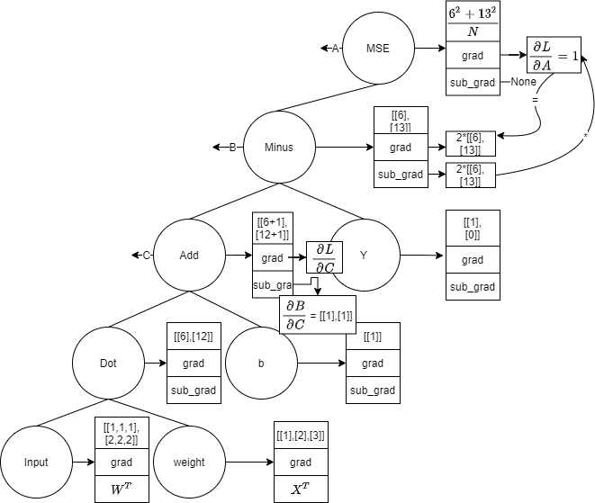

# Neural-Network-Development-Kit
A Neural Network Development Kit for MT4. The main file contains the computation graph algorithm. The Dll1 file is the api of this project, it contains the Dll1.dll file (maxnet.dll). Project1 is for debugging.

## qfsdk.mqh

The qffc.mq4 file is just a demo example that imitates the program in the DemoFann.pdf. Of course, you can use your own data preprocessing methods.

Note that only the maxnet.dll (i.e. the Dll1.dll) file should be imported in the qfsdk.mqh. The other DLL files are required but won't be used during the MQL programming. If you have Visual Studio on your computer, it is fine to delete the other DLL files except for the maxnet.dll.  Happy programming, thanks!

### API

#### build_net()

```C
bool build_net(int& nn_layer, int& feature_num, int& nn_output, const double &inputVector[], const double  &outputVector[], const int &neuron_num[], const int & active[]);
```

`nn_layer` is the number of the hidden layers, `feature_num` is the feature number of the training sample. `nn_output` is the dimension of the label.

`inputVector`: training sample

`outputVector`: label

`neuron_num`: an int type array, stores the neuron number of each hidden layer

`activation`: the array that indicates which activation function to be used. (0: ReLu  ; 1: Sigmoid ; 2: Tanh ; 3: Lee_oscillator )

`return` build the network successfully or not.

```C
int         iter = 5;                    //training iteration for each batch
double      learn_rate = 0.01;

double targetMSE = 0.002;
int feature_num = 3;
int opt  =  0;                  //optmizer : 1 for Adagrad, else gradient descent
int neuron_num[] = {10,3};      //hidden_layer neuron num

//0:ReLu ; 1:Sigmoid ; 2:Tanh ; 3:Lee_oscillator 
int activation[] = {0,0};

bool s = build_net(hidden_layer, feature_num, nn_output, inpt, oupt, neuron_num, activation);
```

#### Predict()

```C
void Predict(int feature_num, int nn_output, const double &inputVector[], double & y_hat[]);
```

`y_hat`: an array that stores the prediction, it should be initialized before the function is called.

```C
double p_hat[] = {0};  //output_num, initialize
Predict(feature_num, nn_output, inputVector, p_hat);
```

#### train()

```C
double train(int feature_num, int nn_output, const double & inputVector[], const double & outputVector[], int iteration, const double& lr, const int& opt);
```

`iteration`: for each sample, we need to update the weights few time, this parameter controls the number of update.

`lr`: the learning rate.

`opt`: the choice for the optimizer, recommend to use the gradient descent, Adaptive gradient descent is not yet mature.

`return`: the mean square error.

#### release_net()

```C
void release_net();
```

release the memory of the network, it should be called if the network wouldn't be used anymore. Also we need this when we want to reconstruct the network.

### Parameter settings

This is an example for the parameter setting.

```c
int         nn_layer   = 4;               // Number of layers (4 including input and output layers)
int         nn_output  = 1;               // number of outputs
double      trainingData[][4];           // IMPORTANT! size = nn_input + nn_output
int         maxTraining = 1000;  
int         hidden_layer = nn_layer - 2;

int         iter = 5;                    //training iteration
double      learn_rate = 0.01;

double targetMSE = 0.002;
int feature_num = 3;
int opt  =  0;                  //optmizer
int neuron_num[] = {10,3};      //hidden_layer neuron num

//0:ReLu ; 1:Sigmoid ; 2:Tanh ; 3:Lee_oscillator 
int activation[] = {0,0};
```


## Nodes.cpp

This toolkit is based on the computation graph model. The node of the graph is define as a class:

```C++
struct Node {

    Eigen::MatrixXd  value;      //MatrixXd is class and value is an object, different from the python version,(pointer)
    Eigen::MatrixXd grad;
    Eigen::MatrixXd sub_grad;
    bool require_grad;
    bool need_update;
    bool BN;
    bool dot;
    bool test;

};

class Nodes {
public:
    Nodes* last_right;
    Nodes* last_left;
    Nodes* next;
    Node  node;

    Nodes(void) {
        //root = &node;
        last_right = NULL;
        last_left = NULL;
        next = NULL;
        node.require_grad = true;
        node.need_update = false;
        node.BN = false;
        node.dot = false;
        node.test = false;

    }
    virtual ~Nodes(void) {}

    virtual Eigen::MatrixXd output_val() {
        return node.value;
    }

    virtual Eigen::MatrixXd compute_gradient() {
        return node.grad;
    }

};
```

The `MatrixXd` class is used for matrix calculation. `need_update` is an attribute to record the node need to be update or not. `require_grad` means this node needs to calculate its gradient.


## Computational Graph

### Nodes

在深度学习框架里底层实现`Back-propagation`算法是通过构建计算图完成，普通的一元运算和二元运算可以简单地通过二叉树实现，

```python
class Node():
    def __init__(self):
        self.last_right = None
        self.last_left = None
        self.next = None
        self.value = None
        self.grad = None
        self.sub_grad = None
        self.require_grad = True
```

二叉树的一个节点的属性如上，我们可以通过继承上面这个基类去设计更多类型的节点，如变量节点`(Variable)`，常数节点`(Constant)`，操作符节点`(Operator)`，输入节点`Input`等等。

每个节点设计有如下方法：

```python
def output_val(self):
    pass

def compute_gradient(self):
    pass

def update_param(self):
    pass
```

几种node的定义如下：

```python
class Input(Node):
    def __init__(self, X):
        super().__init__()
        self.value = X
        # self.require_grad = True

    def output_val(self):

        return self.value

    def compute_gradient(self):         ## compute gradient 是计算下面两个连接的节点，因此非operator的comput_gradient无作用
        pass

class Variable(Node):
    def __init__(self, X):
        super().__init__()
        # self.require_grad = True
        self.value = X
        self.need_update = True

    def output_val(self):
        return self.value

    def compute_gradient(self):         ## compute gradient 是计算下面两个连接的节点，因此非operator的comput_gradient无作用
        pass

class Const(Node):
    def __init__(self, X):
        super().__init__()
        # self.require_grad = True
        self.require_grad = False
        self.value = X
    def output_val(self):
        return self.value

    def compute_gradient(self):         ## compute gradient 是计算下面两个连接的节点，因此非operator的comput_gradient无作用
        pass


class Add(Node):
    def __init__(self, left_node, right_node):
        super().__init__()
        self.last_left = left_node
        self.last_right = right_node
        left_node.next = self
        right_node.next = self

    def output_val(self):
        if self.last_left.value.shape == self.last_right.value.shape:
            self.value = self.last_left.value + self.last_right.value
        elif self.last_left.value.shape[1] == self.last_right.value.shape[1]:      # 加bias的情况
            temp_val = np.ones(self.last_left.value.shape)
            for i in range(self.last_left.value.shape[0]):
                temp_val[i,:] = self.last_right.value[0,:]
            self.value = temp_val + self.last_left.value

    def compute_gradient(self):
        self.last_left.sub_grad = np.ones(self.last_left.value.shape)    ## 以左边节点大小为准
        self.last_right.sub_grad = np.ones(self.last_left.value.shape)
```

`Variable`节点的compute gradient函数没有设计因为这里我默认方式是变量节点是没有入度的，只有operator才有入度。可以看到Add节点的输出方式，如果输入节点shape都一样直接相加，如果不一样则需要复制左边节点使得其形状与右边一致（因为默认b会在左边出现）。

### Dimension Analysis

在这里，我设计的求导方式是基于标量对向量或矩阵进行反向传播，因此`Backward`函数要作用在最后的输出节点（标量）才有意义。Back propagation的详尽运行机制在：

[1]: https://aistudio.baidu.com/aistudio/education/lessonvideo/869145

整个计算图的建立，前向传播计算输出值以及后向传播计算输出值计算梯度如下图所示：



目前求sub_grad的方法很简单，如果是乘法则返回与之相乘的矩阵的转置，如果是加减，则返回与之shape一样的全1矩阵.如上图Add的sub_grad所示。通过`DFS` 深度优先遍历进行前向传播，然后`BFS`层序遍历后向计算梯度：

```python
def Forward(root):
    '''
    :param root: the last operater
    :return: output value 
    '''
    if root == None:
        return root

    Forward(root.last_left)
    Forward(root.last_right)
    root.output_val()

    return root

# breadth-first search
def Backprop(root):
    '''
    :param root:
    :return: need to be updated nodes
    '''
    if root == None or (root.last_left == None and root.last_right == None):
        return

    param = []  # record the nodes that need to be updated

    Q = Queue(10, root)
    Q.enqueue(root)

    while (Q.isEmpty() == False and not Q.isFull()):
        size = Q.queueSize()
        for i in range(size):
            temp = Q.dequeue()
            if temp.grad is None:  # if is the first node
                temp.grad = np.ones(temp.value.shape)
                temp.compute_gradient()
                if temp.need_update == True:
                    param.append(temp)
                if temp.last_left != None and temp.last_left.require_grad:
                    temp.last_left.grad = temp.last_left.sub_grad
                    Q.enqueue(temp.last_left)
                if temp.last_right != None and temp.last_right.require_grad:
                    temp.last_right.grad = temp.last_right.sub_grad
                    Q.enqueue(temp.last_right)
            else:
                temp.compute_gradient()
                if temp.need_update == True:
                    param.append(temp)
                if temp.last_left != None and temp.last_left.require_grad:
                    temp.last_left.grad = chain_rule(temp.grad, temp.last_left.sub_grad, 'l')
                    Q.enqueue(temp.last_left)
                if temp.last_right != None and temp.last_right.require_grad:
                    temp.last_right.grad = chain_rule(temp.grad, temp.last_right.sub_grad, 'r')
                    Q.enqueue(temp.last_right)

    return param

```


### Dense层的设计

本来打算把全连接层直接设计为一个节点，输入节点加上一列全为1，权重矩阵加上一行b，这样可以减少整个二叉树的大小，遍历起来速度应该也会快些（空间换时间）。`weight_bias`储存weight和bias的值，`self.sub_grad`储存的是当前输入的gradient所以是weight的转置，省略掉了bias的gradient。 后面操作发现`Dense`节点的属性如果只有sub_grad和grad无法通过简单的反向传播计算当前节点的梯度，如果这样设计不够general，例如本来当前节点compute gradient可以把下个节点的sub gradient算出来，但Dense层算出来下一层sub gradient和这一层的gradient通过chain_rule相乘得到的不是下一层的gradient，因为Dense层算出来的sub gradient只是 $\frac{\partial L}{\partial A}$ 需要多一个属性储存 $\frac{\partial A}{\partial w}$ ,还有一个属性储存 $\frac{\partial L}{\partial w}$ ，这样结构上就和普通运算的节点不一样，所以没那么general。所以后面采取的方法还是直接设计一个Dense函数，直接用原来的节点搭起来一个全连接层。

由于这里设计的bias和weight是事先定义好shape，而需要根据前面的传入值定义shape，所以前面节点需要值，所以在整个网络初始化时需要输入一个batch_size的数据 （此处不够简洁）。
